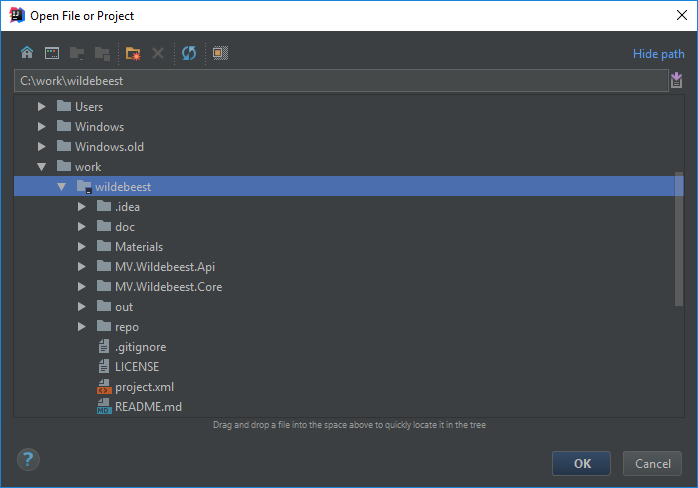
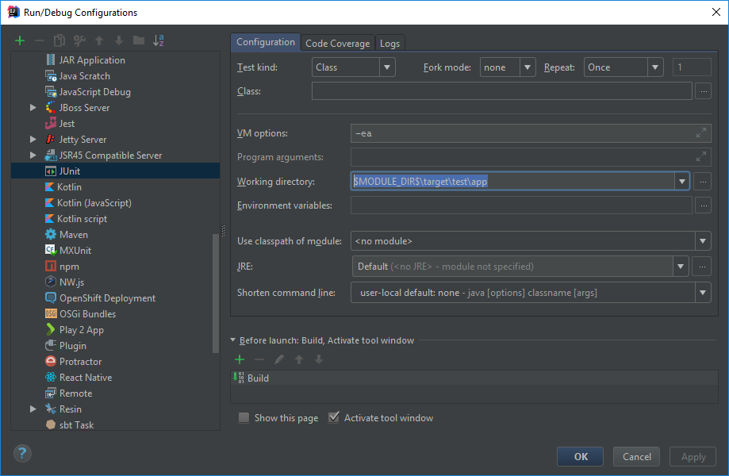
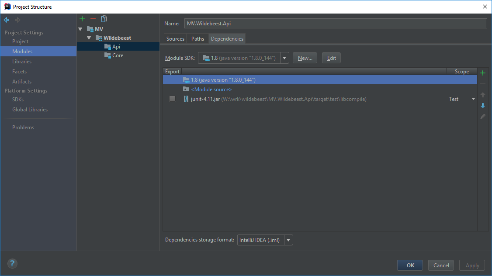
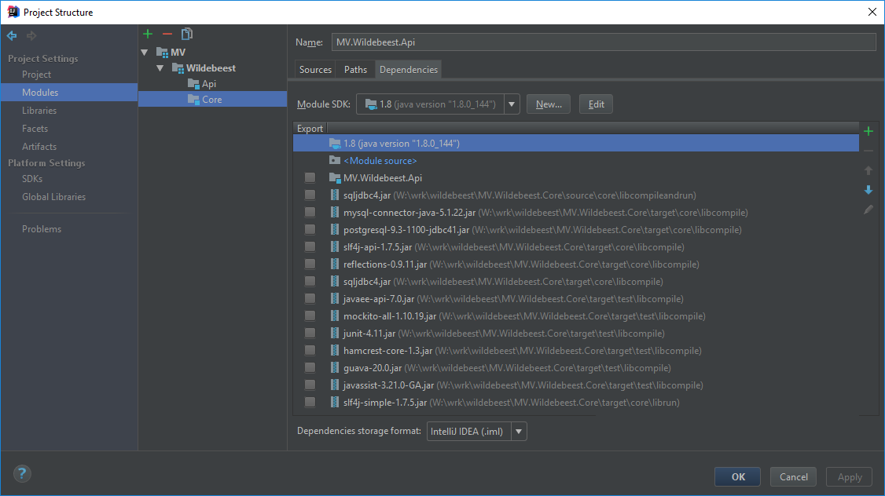

# Developer Guide

## Table of contents
1. [Introduction](#introduction)
2. [Toolchain](#toolchain)
3. [Get The Code](#getTheCode)
4. [Command-Line Quick Start](#commandLineQuickStart)
    1. [Introduction](#introduction1)
    2. [Build the API Component](#buildTheApiComponent)
    3. [Cleaning Up](#cleaningUp) 
5. [IntelliJ Quick Start](#intelliJQuickStart)
    1. [Introduction](#introduction2)
    2. [Preparation](#preparation)
    3. [Building in IntelliJ](#buildingInIntelliJ) 
    4. [Testing in IntelliJ](#testingInIntelliJ)
    5. [Configuration Overview](#configurationOverview)                              
5. [Toolchain Setup](#toolchainSetup)
    1. [JDK](#jdk)
    2. [Apache Ant](#apacheAnt)
    3. [Pre-Flight Check](#preFlightCheck)
6. [Docker](#docker)
    1. [MySQL docker](#mysqlDocker)
    2. [SqlServer Docker](#sqlServerDocker)
    3. [Postgres Docker](#postgresDocker)
    4. [Logs](#dockerlogs)
7. [Docker scripts](#developerScripts) 
    1. [Location](#location)
    2. [Linux/Osx script](#linuxOsxScript)
    3. [Windows script](#windowsScript)
    4. [Setting up dockers with script](#settingUpDockersWithScript)
 
<a name="introduction"></a>
## Introduction

This document will get you started on building and hacking on Wildebeest.

<a name="toolchain"></a>
## Toolchain

The mandatory tools for working on Wildebeest are:

- JDK 1.8 or later
- Any text editor
- A vanilla installation of [Apache Ant](https://ant.apache.org/) 1.8.2 or later

If you want to use an IDE, we recommend using the latest version of IntelliJ.  IntelliJ project files are included.

Regardless of your choice of editor please ensure you configure it to follow our [code standard](Code Standard.md).

We support development on Linux, Windows and macOS.  For guidance on setting up the required tools, see **Toolchain Setup** below.

<a name="getTheCode"></a>
## Get the Code

If you just want to play with the Wildebeest code, you can clone directly from the main repository

```
git clone https://github.com/mathesonventures/wildebeest.git
```

However if you want to start making code changes to submit back to the project, you will need to first fork the project into your own account on GitHub, then clone from your fork.  It is recommended that you create a feature branch in your fork to contain each feature that you work on, and that you submit pull requests to the main repo from a feature branch.

<a name="commandLineQuickStart"></a>
## Command-Line Quick Start

<a name="introduction1"></a>
### Introduction

The most lightweight way to get started is using your command-line tools to build and test Wildebeest.

<a name="buildTheApiComponent"></a>
### Build the API Component

The API component defines a number of interfaces and types that are used by the Core of Wildebeest, and must be built first.  This can be done using Ant as follows:

```
$ cd MV.Wildebeest.Api
$ ant core.jar:pub-project
```

The Ant-based build will retrieve dependencies, compile the code and build a JAR, and publish it to a project-level repository called /repo/ in the root of the project.

Now you can move to the Core component and build it:

```
$ cd ../MV.Wildebeest.Core
$ ant core.jar:pub-project
```

This does the same thing for Core as we just did for API, building and publishing a JAR artifact into the project-level repository at /repo/

You can also run the test suite for Core while you're here:

```
$ ant test.app:report
```

The test report is placed in /target/test/report.

<a name="cleaningUp"></a>
### Cleaning Up

You can clean up the build for each component separately by running the "clean" Ant target:

```
$ ant clean
```

From either component you can also purge the project-level artifact repository using the cleanrepo target:

```
$ ant cleanrepo
```
<a name="IntelliJQuickStart"></a>
## IntelliJ Quick Start

<a name="Introduction2"></a>
### Introduction

This project is setup to require the minimal - actually no - special configuration in your IDE.

The main way this is achieved is by resolving all dependencies from the project itself - not from globally defined libraries.  This slaves IntelliJ to our main build which is driven through Ant.  Similarly the file system structure for unit tests etc is managed by the Ant-driven build, and simply referenced from IntelliJ.

<a name="preparation"></a>
### Preparation

After checking out the code, you will need to run a couple of Ant targets to make sure that all dependencies are in place for IntelliJ to compile the code, and that all test files are in place for IntelliJ to run unit tests.  Therefore before opening the project in IntelliJ, in a shell run the following Ant targets.

First we use the "deps" target to pull down all dependencies for the MV.Wildebeest.Api component:

```
$ cd MV.Wildebeest.Api
$ ant deps
```

Next we do the same for MV.Wildebeest.Core, and we also run the test.app target to assemble the file structure required for unit tests:

```
$ cd ../MV.Wildebeest.Core
$ ant deps
$ ant test.app
```
<a name="buildingInIntelliJ"></a>
### Building in IntelliJ

You can now open the project.  Launch IntelliJ and tell it to open from the root of the repository:



This will open up the project containing both modules - Api and Core.

The usual build actions will work now - for example you can right-click MV.Wildebeest.Api and choose Build or Rebuild, or you can use Ctrl+F9 to build.

Note there is a project-to-project reference configured so that MV.Wildebest.Core is linked to MV.Wildebeest.Api.  This allows you to refactor and compile across the projects without the need to republish the Api artifact in Ant as we did in the Command-Line Quick Start.

<a name="testingInIntelliJ"></a>
### Testing in IntelliJ

You can run tests in IntelliJ as normal, however you may need to first set the default base path so that tests can find the files from the test directory structure.  To make this setting in IntelliJ:

- Go to the Run menu and choose Edit Configurations.

- Expand the Defaults side navigation option and select JUnit

- In the settings pane, set Working Directory to \$MODULE_DIR\$\target\test\app


  

<a name="configurationOverview"></a>
### Configuration Overview

To see the internals of how this configuration is setup:

- Go to File / Project Structure

- On the left navigation strip choose Modules, then in the next panel choose MV / Wildebeest / Api

- Choose the Dependencies tab.  Here you'll see that the JUnit JAR is referenced from the target/ directory structure that was created by our Ant build.  This is where Ant / Ivy placed the JAR when resolving dependencies:

  

  

  

- Also take a look at the Dependencies tab for the module MV / Wildebeest / Core.  This is similar, but there are just more dependencies.  All these dependencies come from the target/ directory structure except for MV.Wildebeest.Api which is a project reference as mentioned above.

  

  

  

While this configuration approach forces the extra step of running ant deps a couple of times, it also makes the project extremely portable as IntelliJ does not rely on you having any particular resources available on your development rig.

<a name="toolchainSetup"></a>
## Toolchain Setup

<a name="jdk"></a>
### JDK

Get the latest Java SE SDK from Oracle at http://www.oracle.com/technetwork/java/javase/downloads/index.html.  Choose the package appropriate for your OS and architecture and install it.

<a name="apacheAnt"></a>
### Apache Ant

- Get the latest Ant ZIP distro from https://ant.apache.org/bindownload.cgi.
- Unpack it somewhere appropriate such as /opt/apache-ant on Linux or C:\opt\apache-ant on Windows.
- Define an environment variable called ANT_HOME set to that path.
- Add Ant to your path:
  - On Linux append $ANT_HOME/bin
  - On Windows append %ANT_HOME%/bin
  
<a name="preFlightCheck"></a>
### Pre-Flight Check

Before going back to hack on Wildebeest, make sure your tools are setup correctly:

```
$ javac -version
javac 1.8.0_144

$ java -version
java version "1.8.0_144"
Java(TM) SE Runtime Environment (build 1.8.0_144-b01)
Java HotSpot(TM) 64-Bit Server VM (build 25.144-b01, mixed mode)

$ ant -version
Apache Ant(TM) version 1.8.2 compiled on December 20 2010
```
<a name="docker"></a>
## Docker 

:exclamation: Linux may require sudo in front of every docker command

<a name="mysqlDocker"></a>
### MySQL Docker:

1. First step is to pull mysql image from official docker repo 
    ```    
    $ docker pull mysql
    ```
2. Next you need to create container with image you have just pulled. Running container is as simple as 
   "docker run -it name-of-image" but we need some additional parameters to setup base.
    ```
    $ docker run -it --name some-mysql -e MYSQL_ROOT_PASSWORD=my-secret-pw -d mysql:latest -p 3306:3306 
    ```
3. Inspect that your docker image is up and running
    ```   
    $ docker ps
    ```
4. If you don't see your container try running 
    ```
    $ docker ps -a
    ```   
     What this does is shows all docker containers, either currently running or stopped. If your container is stopped try
     restarting it.
    ```
    $ docker restart name-of-container
    ```
5. if everything is okay you should be able to execute following command
    ```   
    $ docker exec -it name-of-container mysql -uroot -p
    ```
<a name="sqlServerDocker"></a>
### SQLServer docker:


1. First step is to pull sqlserver image from official docker repo 
    ```
    $ docker pull microsoft/mssql-server-linux:2017-latest
    ```
2. Next you need to create container with image you have just pulled. Running container is as simple as 
   "docker run -it name-of-image" but we need some additional parameters to setup base.
    ```
    $ docker run -it -e 'ACCEPT_EULA=Y' -e 'SA_PASSWORD=password' -p 1433:1433 --name sql1 -d microsoft/mssql-server-linux:2017-latest
    ```
3. Inspect that your docker image is up and running
    ```   
    $ docker ps
    ```
4. If you don't see your container try running 
    ```   
    $ docker ps -a
    ```
    What this does is shows all docker containers, either currently running or stopped. If your container is stopped try
    restarting it.
       
    ```
    $ docker restart name-of-container
    ```
5. enter the docker with following command 
    ```
    $ docker exec -it name-of-container "bash"
    ```
6. connect to sqlcmd
    ```
    $ docker exec -it name-of-container "bash"
    ```
    once inside docker container:
    ```
    $ /opt/mssql-tools/bin/sqlcmd -S localhost -U SA -P '<YourNewStrong!Passw0rd>'
    ```
<a name="postgresDocker"></a>
### Postgres docker 

1. First step is to pull postgres image from official docker repo 
    ```
    $ docker pull postgres
    ```
2. Next you need to create container with image you have just pulled. Running container is as simple as 
   "docker run -it name-of-image" but we need some additional parameters to setup base.
    ```
    $ docker run -it --name postgresserver -e POSTGRES_PASSWORD=my-secret-pw -d postgres
    ```
3. Inspect that your docker image is up and running
    ```   
    $ docker ps
    ```
4. If you don't see your container try running 
    ```   
    $ docker ps -a
    ```
   What this does is shows all docker containers, either currently running or stopped. If your container is stopped try
   restarting it.
    ```
    $ docker restart name-of-container
    ```
<a name="dockerlogs"></a>   
##### Logs can be seen/found: 
```
RHEL, Oracle Linux          /var/log/messages
Debian	                    /var/log/daemon.log
Ubuntu 16.04+, CentOS	    Use the command journalctl -u docker.service
Ubuntu 14.10-	            /var/log/upstart/docker.log
macOS (Docker 18.01+)	    ~/Library/Containers/com.docker.docker/Data/vms/0/console-ring
macOS (Docker <18.01)	    ~/Library/Containers/com.docker.docker/Data/com.docker.driver.amd64-linux/console-ring
Windows	                    AppData\Local 
```    

<a name="developerScripts"></a>   
##Docker scripts 

<a name="location"></a>  
### Location
Docker scripts can be found in "docker_scripts" folder. There are both bash (linux/osx ) and batch (windows)
script that can be used to setup dockers to be used with wildebeest. This is recommended way of setting up dockers
to have working environment.

<a name="linuxOsxScript"></a>
##### Linux/Osx script
:exclamation: linux requires root privileges to use this script

##### For Linux/Osx available list of commands is:

-c  --clean   Removes docker containers and images<br/>
-h, --help    Prints help message and exits script<br/>
-l, --list    Lists all running docker containers<br/>
--setup       Pulls and creates all predefined docker containers to be ready for use<br/>
-s, --start   Starts docker containers predefined in script<br/>
-x, --stop    Stops all docker containers predefined in script<br/>


<a name="windowsScript"></a>
##### Windows script
:exclamation: You need to have installed Docker for windows in order to be able to 
run docker on Windows machine.

##### For Windows available list of commands is:

--clean   Removes docker containers and images<br/>
--help    Prints help message and exits script<br/>
--list    Lists all running docker containers<br/>
--setup   Pulls and creates all predefined docker containers to be ready for use<br/>
--start   Starts docker containers predefined in script<br/>
--stop    Stops all docker containers predefined in script<br/>

<a name="settingUpDockersWithScript"></a>
### Setting up dockers with script

:exclamation: Operating system does not matter, so steps are the same for both Linux, Osx and Windows.


##### First time setup

```   
    $ ./manage --setup 
```

Wait until prompt is returned and check that docker containers are running with command: 
```   
   $ docker ps
```
If you have running docker containers, congratulations, you have just setup 
docker containers to work with Wildebeest.


##### Everyday usage

To run docker containers after you have set them up, if they are not running already for any 
kind of reason you can use:

```   
    $ ./manage --start 
```

to run all containers, or:

```   
    $ ./manage --start name_of_docker_container 
```

to run only one if you don't need them all.
You can use same  logic with

```   
    $ ./manage --stop 
```

to stop all docker containers, or :

```   
    $ ./manage --stop name_of_docker_container
```
to stop only one container.

You can also use:
```   
    $ ./manage --clean
```

if you wish to delete all docker containers from your system that have been setup by this script.


:exclamation: These scripts are setup so that they only affect Wildebeest dockers, so they will not
affect any other dockers that you have on system. You can't use this script to clean, setup, start or stop any other
docker containers unless you first modify it.


