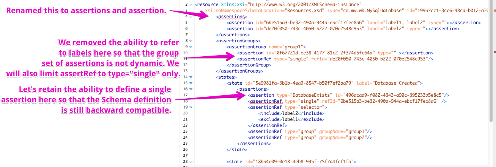

# Design

## Introduction

This document captures the design of Wildebeest and it's primary audience is the Wildebeest contributor team.

This is a living document and changes as we evolve the concept and direction for Wildebeest.  What is presented here represents both functionality that the product has already, as well as future-state improvements we want to see in the product.  Although this document makes reference to current and future state, we don't guarantee a clear view of that here.  For a clear explanation of the **current** state of the product refer to the user documentation.

## Assertions

### Overview



Assertions can be uniquely identified by ID or by optional name.  Assertions are also labelled resources, and can be selected by a label-based selector expression.

### Definition

Assertions can be defined:

- Globally in the \<assertions\> section.  These assertions do not apply to anything, until they are referenced from an \<assertionGroup\> a \<state\> or a \<migration\> with an \<assertionRef\>
- In-line in a \<group\>
- In-line in a \<state\>
- In-line in a \<migration\>

### Assertion Groups

Assertion groups enable you to create a list of assertions that can be referenced and applied as a unit.  This enables you to more easily define and use common sets of assertions that need to be applied across many states or even in many pre-migration assertions.

Assertion groups are defined globally and do not apply to anything until they are referenced from a \<state\> or a \<migration\> with an \<assertionRef\>.  Note an assertion group can include "single" type assertion refs, but cannot include "group" or "selector" type assertion refs.  This is to ensure that the structures around assertions are kept relatively flat to avoid definitions becoming complex and difficult to reason about.

References:

- [MVWB-47 - Assertion Groups](https://mathesonventures.atlassian.net/browse/MVWB-47)

### Assertion References

Globally defined assertions can be referenced and linked into a \<state\> or a \<migration\> either singly or using a label-based selector expression.

A "single" assertion reference identifies the assertion that was defined at the global level either by ID or by name.  For example:

```
<assertionRef type="single" id="56bddb97-cbce-4eff-b5bc-b8161974cc1a" />

<assertionRef type="single" name="universeIdNotNull" />
```

A "group" assertion reference identifies the assertion group that was defined at the global level either by ID or by name.  For example:

```
<assertionRef type="group" id="c5e5be66-df2b-4ed3-a1c2-76b992a1bbae" />

<assertionRef type="group" name="patientDemographicChecks" />
```

"group" type assertion refs cannot be used in \<assertionGroup\>'s - only in \<state\>'s and \<migration\>'s.

A "selector" assertion reference dynamically finds a set of assertions based on an expression that queries over the labels that have been applied to the assertions defined at the global level.  For example:

```
<assertionRef type="selector">
    <include>patient_demographics</include>
    <include>patient_index_linkage</include>
    <exclude>us_patients</exclude>
</assertionRef>
```

TODO: Aside from full-match based include and exclude, are there other expression primitives that we should support?

TODO: Think about other dimensions that could be part of a selector.  E.g. would it be useful to be able to select assertions based on type?

"selector" type assertion refs cannot be used in \<assertionGroup\>'s - only in \<state\>'s and \<migration>'s.

References:

- [MVWB-154 - Single Assertion Refs](https://mathesonventures.atlassian.net/browse/MVWB-154)
- [MVWB-155 - Selector Assertion Refs](https://mathesonventures.atlassian.net/browse/MVWB-155)

### State Assertions

Assertions for a \<state\>'s can be tested at any time when the resource is declared to be in that state, and they should pass.

State-level assertions are applied:

- To verify the current state of a resource before attempting the migration.
- To verify the state of a resource after each migration has been completed,
- On demand if the user requests through the CLI / API / UI for the state of the resource to be verified.

References:

- [MVWB-152 - Apply assertions for the current state prior to migrating](https://mathesonventures.atlassian.net/browse/MVWB-152)

### Migration Assertions

Assertions for a \<migration\> are applied before that migration is performed.  These assertions have a special role - they are for performing pre-flight checks on the resource before the migration is applied.  These are checks that would not naturally belong to a \<state\>.

NOTE: This feature is currently under discussion.  It needs more real-world use-cases to justify it.

References:

- [MVWB-26 - Pre-Migration Assertions](https://mathesonventures.atlassian.net/browse/MVWB-26)

